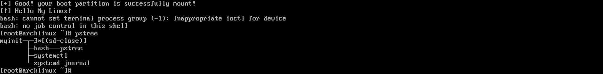

# assn1

Assignment for Chapter 2. Process

## Tasks

 * Update `BOOT_PT` in `setup.c`
 * Add appropriate `fork` and `execvp` to `spawn_shell.c`
 * Install binary with `make install`
 * Update `refind_linux.conf` to start with the custom init
 * see `pstree` result

## Expected result

